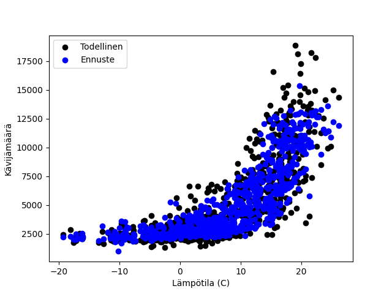

# LATI-MLPR

### Model settings

- Input layer: 5
- Hidden layers: (250, 200, 150, 20)
- Output layer: 1
- Activation: ReLU
- Solver: adam 
- max_iter: 2000
- batch_size: 32

### Model information
- Model determination:  0.7988761759628186
- Mean squared error: 1.54e+03 (30.6%)
- Coefficient of determination: 0.80

<br>



<br>

```python
pip install -r requirements.txt
```

```python
python server.py
```


https://lati-ennuste.onrender.com/
